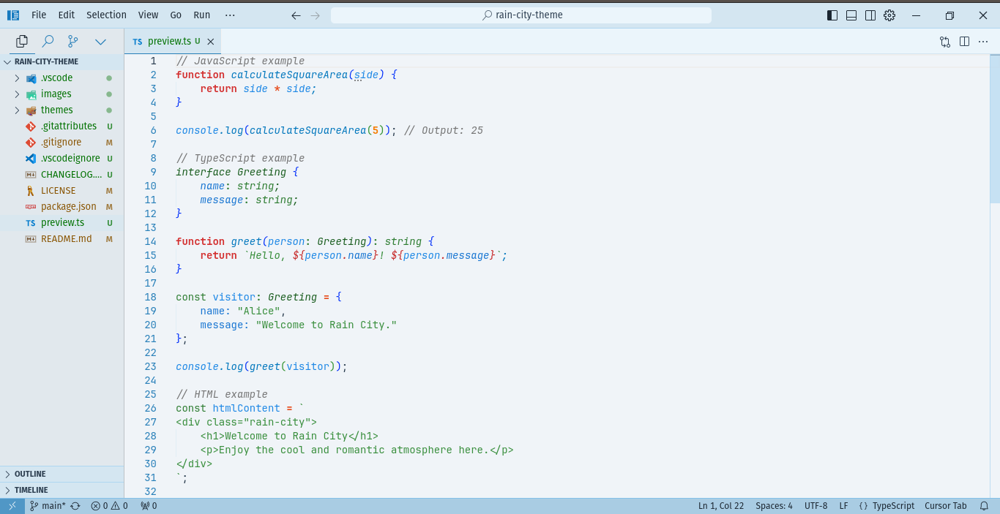
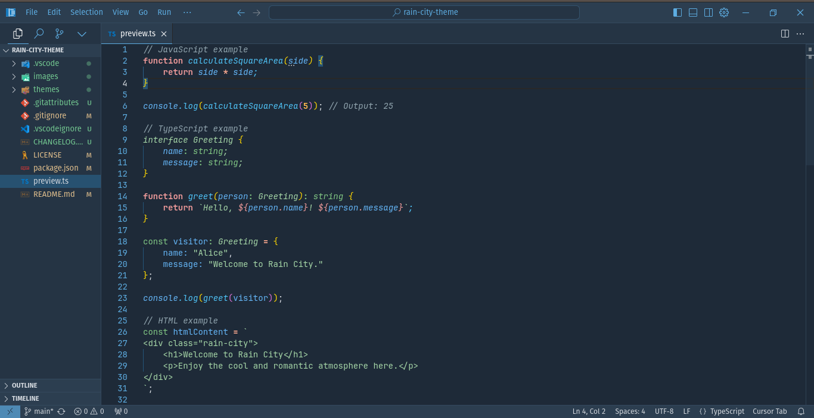

# Rain City Theme 🌧️


Rain City Theme is an elegant Visual Studio Code theme, inspired by the beauty of a city in the rainy season. Designed for eye comfort and long-term productivity.




## ✨ Features

- 🌓 Light and dark theme versions
- 🎨 Soft and harmonious color scheme
- 🖥️ Optimized for various programming languages
- 👀 Good contrast for long-term readability
- 🔧 Easy to customize

## 🚀 Installation

1. Open Visual Studio Code
2. Open the Extensions panel (Ctrl+Shift+X / Cmd+Shift+X)
3. Search for "Rain City Theme"
4. Click Install
5. After installation, select "Rain City Theme Light" or "Rain City Theme Dark" from the Color Theme menu (Ctrl+K Ctrl+T / Cmd+K Cmd+T)

## 🔧 Customization

You can further customize the theme by adding the following settings to your `settings.json`:

```json
{
  "workbench.colorCustomizations": {
    "[Rain City Theme Light]": {
      "editor.background": "#f5f5f5"
      // Add other customizations here
    },
    "[Rain City Theme Dark]": {
      "editor.background": "#1a1a1a"
      // Add other customizations here
    }
  }
}
```

## 💻 Supported Languages

Rain City Theme has been optimized for various programming languages, including but not limited to:

- JavaScript/TypeScript
- Python
- Java
- C/C++
- HTML/CSS
- Markdown
- JSON
- PHP
- Ruby
- Go

## 🎨 Design Philosophy

Rain City Theme is designed with the following principles:

1. **Readability**: Balanced color contrast to reduce eye strain.
2. **Consistency**: Consistent color scheme across UI elements and syntax.
3. **Aesthetics**: Color palette inspired by the ambiance of a city in the rainy season.
4. **Flexibility**: Easily customizable for individual preferences.


## 🐛 Reporting Issues

If you encounter any issues or have suggestions for improvements, please create an issue on the [Issues page](https://github.com/username/rain-city-theme/issues).

## 📜 License

Rain City Theme is licensed under the [MIT License](LICENSE).


## 🔮 Future Plans

We are continuously working to improve Rain City Theme. Some features planned for upcoming versions include:

- Support for more programming languages
- Additional theme variations
- Integration with latest VS Code features

Stay tuned for our updates!

---

Created with ☕ and 💻 by [Dani Syam](https://danisyam.github.io)
